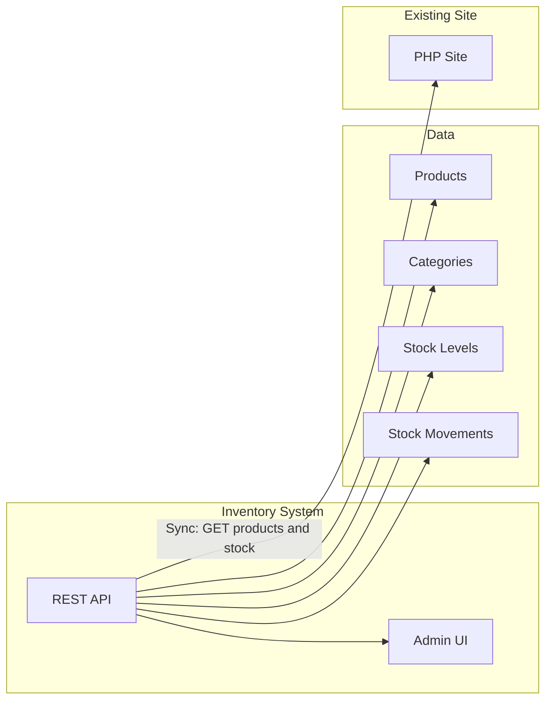

# S3VT Group Inventory System – Development Plan

## Understanding

- **Client:** S3VT Group (s3vtgroup.com.kh) – forklift & industrial equipment (truck scales, digital scales, storage racking, lifting equipment, material handling).
- **Products:** Have SKU, category, name, price (often “Price on Request”), stock status (e.g. “On Order”), description/specs, and optional related products.
- **Goal:** Build an inventory system that **integrates with the existing website** so product data and stock status can be synced to the live site (products.php / product.php).
- **Workspace:** Greenfield ([README.md](README.md) only).

---

## Integration approach (Option B)

The inventory system will be the **source of truth** for product catalog and stock. The existing PHP site will consume this data via one of:

- **A. API:** Inventory backend exposes REST (or GraphQL) API; PHP site calls it (or a small sync script) to get products and stock status.
- **B. Shared database:** Inventory app and PHP site both use the same DB; PHP reads products/stock from the same tables (or views). Easiest if the current site already uses MySQL and you can extend its schema.
- **C. Sync job:** Inventory app pushes changes (products + stock) to the PHP site’s DB or files on a schedule or on change.

**Recommendation:** Start with **shared database (B)** if the existing site uses MySQL and you have access to its schema; otherwise use **API (A)** so the PHP site (or a small PHP/cron script) fetches products and stock from the inventory API. The plan below uses “API-first” so it works even when the PHP DB is not shared.

---

## Recommended tech stack

| Layer            | Choice                                                                        | Rationale                                                                                                             |
| ---------------- | ----------------------------------------------------------------------------- | --------------------------------------------------------------------------------------------------------------------- |
| Backend          | **Node.js (Express or Fastify)** or **PHP (Laravel)**                         | Node: clean REST API, easy to add sync webhooks/jobs. Laravel: same stack as site, one language, can share DB easily. |
| DB               | **MySQL** or **PostgreSQL**                                                   | Fits typical hosting; use same as existing site if shared-DB.                                                         |
| Frontend (admin) | **React** or **Vue** SPA, or server-rendered (Laravel Blade / Node templates) | SPA gives a modern admin UX; server-rendered is simpler and fewer moving parts.                                       |
| Auth             | JWT or session-based auth for admin users                                     | Restrict inventory UI and API to staff only.                                                                          |

**Suggested default:** **Node.js + Express + MySQL + React (or simple server-rendered UI)** for a clear API boundary and future flexibility; alternatively **Laravel + MySQL + Blade** if you prefer to stay in PHP and maximize shared-DB integration.

---

## Core modules and data model (high level)

- **Products:** id, sku, name, slug, category_id, description, specifications (JSON or table), price_display_type (e.g. “on_request” vs fixed), image_urls, related_product_ids, created/updated.
- **Categories:** id, name, slug, image_url, sort_order (align with site: Truck Scale, Digital Scale, Storage Racking, Lifting, Material Handling).
- **Stock / stock_status:** product_id, quantity (optional), status enum (e.g. `in_stock`, `on_order`, `out_of_stock`), warehouse/location if needed later.
- **Stock movements:** product_id, type (in, out, adjustment, transfer), quantity, reference (PO/sale/order id), notes, user_id, created_at.
- **Users:** admin users for login (and optionally roles: viewer, editor, admin).

Optional later: quotes/orders linking to product and optional reservation of stock; multi-warehouse; reorder points and alerts.

---

## Phased implementation

**Phase 1 – Foundation and products**

- Set up project (backend + DB + migrations), auth (login for staff), and basic CRUD for **categories** and **products** (including SKU, slug, stock_status, price_display_type).
- Implement **stock movements** (in/out/adjustment) and derive or store **stock status** (and quantity if applicable) on the product or a stock table.
- **Sync to website:** Provide API endpoints the PHP site can call, e.g. `GET /api/products` and `GET /api/products/:id` (or by slug), including category and stock status; document response format. Optionally a small PHP script or cron that periodically fetches and updates the existing site’s product/stock display.

**Phase 2 – Admin UI and operations**

- Admin UI: product list (filter by category, search by name/SKU), create/edit product, category management, record stock movements, view simple stock history.
- Validation, error handling, and logging; restrict all admin and API routes to authenticated users (and optionally API key for server-to-server sync).

**Phase 3 – Reporting and polish**

- Basic reports: low stock / out-of-stock list, movement history by product or date range.
- Sync robustness: idempotent endpoints, clear docs for the PHP side; if using shared DB, add views or tables the PHP site reads from.

---

## Files and structure (suggested)

- **Backend (e.g. Node + Express):**  
`server.js`, `config/`, `routes/` (auth, categories, products, stock-movements), `models/` or `db/` (schema + queries), `middleware/auth.js`, `package.json`, `.env.example`.
- **Frontend (admin):**  
`client/` or `admin-ui/` with React/Vue or server-rendered pages (e.g. `views/` if using server-side templates).
- **DB:**  
Migration files or SQL schema for categories, products, stock, stock_movements, users.
- **Docs:**  
Short README with setup and **API contract** for sync (list products, get product by slug/id, fields for stock status).

---

## Out of scope (unless you request later)

- Changing the existing PHP site’s front-end design or URL structure.
- Public-facing e‑commerce (cart/checkout) in the inventory app; focus is internal inventory + sync to existing site.
- Native mobile app; admin can be responsive web only initially.

---

## Summary

- **Option B:** Inventory system integrates with s3vtgroup.com.kh by exposing an API (or shared DB) so product catalog and stock status stay in sync with the live site.
- **Deliverables:** Backend (API + DB + auth), admin UI for products/categories/stock movements, and documented sync mechanism for the PHP site.
- **Next step after approval:** Lock tech choice (Node vs Laravel, DB engine), then implement Phase 1 (project setup, categories/products CRUD, stock status and movements, sync API).

